1. UML domain class diagram [Click here to view the diagram.](https://www.mermaidchart.com/raw/22938670-8cc5-41cc-a3b0-4bfda2abec12?theme=light&version=v0.1&format=svg)

```mermaid
classDiagram

    Entity --|> Address 
    Entity --|> BlogPost
    Entity --|> Brand
    Entity --|> Cart
    Entity --|> CartItem
    Entity --|> Category
    Entity --|> CategoryDiscount
    Entity --|> CategoryTaxSettings
    Entity --|> Comment
    Entity --|> Country
    Entity --|> CountryTaxSettings
    Entity --|> Currency
    Entity --|> CustomerTypeTaxSettings
    Entity --|> Discount
    Entity --|> Language
    Entity --|> LocaleSettings
    Entity --|> Product
    Entity --|> Review
    Entity --|> SKU
    Entity --|> Supplier
    Entity --|> SupplierDiscount
    Entity --|> TaxSettings
    Entity --|> Translation
    Entity --|> User

    class Address {
        String line
        String city
        String state
        String postalCode
        Country country
    }
    Address "1" --o "1" Country : belongs to

    class BlogPost {
        String title
        String content
        User author
        List~Comment~ comments
    }
    BlogPost "0..*" --> "1" User : authored by

    class Comment {
        BlogPost blogPost
        User author
        String content
    }
    Comment "0..*" --* "1" BlogPost : related to
    Comment "0..*" --> "1" User : created by

    class Cart {
        User user
        List~CartItem~ items
        Price totalPrice
    }
    Cart "0..*" --> "1" User : belongs to

    class CartItem {
        Cart cart
        SKU sku
        int quantity
        Price subtotal
    }
    CartItem "1..*" --* "1" Cart : part of
    CartItem "1" --> "1" SKU : references
    CartItem "1" --> "1" Price : calculated as

    class Brand {
        String name
        String description
        List~Translation~ translations
        String logoUrl
    }
    Brand "1" --> "0..*" Translation : name/description are

    class Category {
        String name
        String description
        List~Translation~ translations
        URI imageUrl
        Category parentCategory
        List~Category~ childCategories
    }
    Category "1" --* "0..1" Category : parent of
    Category "1" --> "0..*" Category : has childs
    Category "1" --> "0..*" Translation : name/description are

    class CategoryDiscount {
        Category category
        Discount discount
    }
    CategoryDiscount "1" --> "1" Category : applies to
    CategoryDiscount "1" --> "1" Discount : uses

    class CategoryTaxSettings {
        Category category
        TaxSettings taxSettings
    }
    CategoryTaxSettings "1" --> "1" Category : applies to
    CategoryTaxSettings "1" --> "1" TaxSettings : configures

    class Country {
        String code
        String name
        List~Translation~ translations
        Currency currency
        Language language
        String phoneCode
        String timeZone
    }
    Country "1" --> "0..*" Translation : named as
    Country "1" --> "1" Currency : uses
    Country "1" --> "1" Language : has

    class CountryTaxSettings {
        Country country
        TaxSettings taxSettings
    }
    CountryTaxSettings "1" --> "1" Country : references
    CountryTaxSettings "1" --> "1" TaxSettings : configures

    class CustomerTypeTaxSettings {
        CustomerType customerType
        TaxSettings taxSettings
    }
    CustomerTypeTaxSettings "1" --> "1" CustomerType : references
    CustomerTypeTaxSettings "1" --> "1" TaxSettings : configures

    class CustomerType {
        <<enumeration>>
        INDIVIDUAL
        ENTREPRENEUR
        ORGANIZATION
    }

    class Product {
        String name
        String description
        List~Translation~ translations
        Brand brand
        Category category
        Supplier supplier
        URI imageUrl
        List~SKU~ skus
        List~Review~ reviews
    }
    Product "1" --> "0..*" Translation : named/described as
    Product "1" --> "1" Brand : belongs to
    Product "0..*" <-- "1" Brand : has
    Product "1..*" --> "0..*" Category : belongs to
    Category "0..*" --> "0..*" Product : contains
    Product "1" --> "1" Supplier : provided by
    Product "0..*" <-- "1" Supplier : provided by
    Product "1" --> "1..*" SKU : contains
    Product "1" --> "0..*" Review : linked to

    class SKU {
        String code
        Product product
        String variant
        Price price
        int quantity
        Dimension dimension
        URI imageUrl
    }
    SKU "1..*" --> "1" Product : belongs to
    SKU "1" --> "1" Price : priced as
    SKU "1" --> "1" Dimension : has

    class Supplier {
        String name
        String email
        String phone
        Address address
        List~Product~ products
    }
    Supplier "1" --> "0..1" Address : located at
    Supplier "1" --> "0..*" Product : associated

    class Entity {
        UUID id
        LocalDateTime createdAt
        LocalDateTime updatedAt
    }

    class Translation {
        String label
        String text
        Language language
    }
    Translation "1" --> "1" Language : uses
    Translation "0..*" <-- "1" Language

    class Language {
        String code
        String name
    }

    class Discount {
        String promoCode
        String name
        String description
        List~Translation~ translations
        BigDecimal percentage
        LocalDateTime validFrom
        LocalDateTime validUntil
        boolean active
    }
    Discount "1" --> "0..*" Translation : for name or description

    class TaxSettings {
        String name
        String description
        List~Translation~ translations
        BigDecimal rate
        boolean isActive
    }
    TaxSettings "1" --> "0..*" Translation : named/described

    class Dimension {
        double weight
        double length
        double width
        double height
    }

    class Review {
        User user
        Product product
        int rating
        String comment
    }
    Review "0..1" <-- "1" User
    Product "1" --> "0..*" Review

    class User {
        String username
        String email
        UserRole role
        boolean enabled
        LocaleSettings localeSettings
    }
    User "1" --> "1" UserRole
    User "1" --> "1" LocaleSettings

    class Price {
        BigDecimal amount
        Currency currency
    }
    Price "1" --> "1" Currency

    class LocaleSettings {
        Country country
        Language language
        Currency currency
        String dateFormat
        String timeFormat
    }
    LocaleSettings "1" --> "1" Country
    LocaleSettings "1" --> "1" Language
    LocaleSettings "1" --> "1" Currency

    class SupplierDiscount {
        Supplier supplier
        Discount discount
    }
    SupplierDiscount "1" --> "1" Supplier
    SupplierDiscount "1" --> "1" Discount

    class Currency {
        String code
        String symbol
        BigDecimal exchangeRate
    }
    
    class UserRole {
        <<enumeration>>
        GUEST
        CUSTOMER
        SUPPLIER
        PARTNER
        ADMIN
        MODERATOR
    }
```

2. E-commerce portal possible microservices  [Click here to view the diagram.](https://www.mermaidchart.com/raw/493089c9-5916-4101-a560-f5cb0f745440?theme=light&version=v0.1&format=svg)

3 C4 diagram (Context level and container(app) level)

3.1 Context [c4context](https://s.icepanel.io/m6pz7XWBOcQnVa/HOMv)
<svg xmlns="http://www.w3.org/2000/svg" xmlns:xlink="http://www.w3.org/1999/xlink" version="1.1" width="1776" height="560"><g id="Context Diagram"><g id="Uses with limited functionality"><polyline points="1616,192 1616,296 1040,296 1040,400" fill="none" stroke-width="1" stroke="#adb3b3" opacity="1"></polyline></g><g id="Uses with limited functionality"><rect width="119.821" height="36.8" x="1556.0895" y="252" rx="4" ry="4" fill-opacity="0.8" fill="#323435" stroke-opacity="1" stroke-width="1" stroke="#434647" opacity="0.8"></rect><g opacity="1" fill="#e5e7e8"><text font-family="Lato, Arial, sans-serif" font-size="14" text-anchor="middle" x="1616" y="267.818"><tspan dy="0" x="1616">Uses with limited</tspan></text><text font-family="Lato, Arial, sans-serif" font-size="14" text-anchor="middle" x="1616" y="283.818"><tspan dy="0" x="1616">functionality</tspan></text></g></g><g id="Processes payments via widgets"><polyline points="1168,464 1352,464" fill="none" stroke-width="1" stroke="#adb3b3" opacity="1"></polyline></g><g id="Processes payments via widgets"><rect width="138.392" height="36.8" x="1190.804" y="445.6" rx="4" ry="4" fill-opacity="0.8" fill="#323435" stroke-opacity="1" stroke-width="1" stroke="#434647" opacity="0.8"></rect><g opacity="1" fill="#e5e7e8"><text font-family="Lato, Arial, sans-serif" font-size="14" text-anchor="middle" x="1260" y="461.418"><tspan dy="0" x="1260">Processes payments</tspan></text><text font-family="Lato, Arial, sans-serif" font-size="14" text-anchor="middle" x="1260" y="477.418"><tspan dy="0" x="1260">via widgets</tspan></text></g></g><g id="Uses with aditional functionality"><polyline points="1328,192 1328,296 1040,296 1040,400" fill="none" stroke-width="1" stroke="#adb3b3" opacity="1"></polyline></g><g id="Uses with aditional functionality"><rect width="131.014" height="36.8" x="1262.493" y="223.2" rx="4" ry="4" fill-opacity="0.8" fill="#323435" stroke-opacity="1" stroke-width="1" stroke="#434647" opacity="0.8"></rect><g opacity="1" fill="#e5e7e8"><text font-family="Lato, Arial, sans-serif" font-size="14" text-anchor="middle" x="1328" y="239.01799999999997"><tspan dy="0" x="1328">Uses with aditional</tspan></text><text font-family="Lato, Arial, sans-serif" font-size="14" text-anchor="middle" x="1328" y="255.01799999999997"><tspan dy="0" x="1328">functionality</tspan></text></g></g><g id="Administers"><polyline points="1040,192 1040,400" fill="none" stroke-width="1" stroke="#adb3b3" opacity="1"></polyline></g><g id="Administers"><rect width="86.613" height="20.8" x="996.6935" y="223.2" rx="4" ry="4" fill-opacity="0.8" fill="#323435" stroke-opacity="1" stroke-width="1" stroke="#434647" opacity="0.8"></rect><g opacity="1" fill="#e5e7e8"><text font-family="Lato, Arial, sans-serif" font-size="14" text-anchor="middle" x="1040" y="239.01799999999997"><tspan dy="0" x="1040">Administers</tspan></text></g></g><g id="Uses API to offer products"><polyline points="456,192 456,296 1040,296 1040,400" fill="none" stroke-width="1" stroke="#adb3b3" opacity="1"></polyline></g><g id="Uses API to offer products"><rect width="118.47" height="36.8" x="396.765" y="252.79999999999998" rx="4" ry="4" fill-opacity="0.8" fill="#323435" stroke-opacity="1" stroke-width="1" stroke="#434647" opacity="0.8"></rect><g opacity="1" fill="#e5e7e8"><text font-family="Lato, Arial, sans-serif" font-size="14" text-anchor="middle" x="456" y="268.61800000000005"><tspan dy="0" x="456">Uses API to offer</tspan></text><text font-family="Lato, Arial, sans-serif" font-size="14" text-anchor="middle" x="456" y="284.61799999999994"><tspan dy="0" x="456">products</tspan></text></g></g><g id="Moderates blogs and news"><polyline points="744,192 744,296 1040,296 1040,400" fill="none" stroke-width="1" stroke="#adb3b3" opacity="1"></polyline></g><g id="Moderates blogs and news"><rect width="116.272" height="36.8" x="685.864" y="224" rx="4" ry="4" fill-opacity="0.8" fill="#323435" stroke-opacity="1" stroke-width="1" stroke="#434647" opacity="0.8"></rect><g opacity="1" fill="#e5e7e8"><text font-family="Lato, Arial, sans-serif" font-size="14" text-anchor="middle" x="744" y="239.81799999999998"><tspan dy="0" x="744">Moderates blogs</tspan></text><text font-family="Lato, Arial, sans-serif" font-size="14" text-anchor="middle" x="744" y="255.81799999999998"><tspan dy="0" x="744">and news</tspan></text></g></g><g id="Uses API to get product info"><polyline points="160,192 160,296 1040,296 1040,400" fill="none" stroke-width="1" stroke="#adb3b3" opacity="1"></polyline></g><g id="Uses API to get product info"><rect width="108.25" height="36.8" x="110.67500000000001" y="277.6" rx="4" ry="4" fill-opacity="0.8" fill="#323435" stroke-opacity="1" stroke-width="1" stroke="#434647" opacity="0.8"></rect><g opacity="1" fill="#e5e7e8"><text font-family="Lato, Arial, sans-serif" font-size="14" text-anchor="middle" x="164.8" y="293.418"><tspan dy="0" x="164.8">Uses API to get</tspan></text><text font-family="Lato, Arial, sans-serif" font-size="14" text-anchor="middle" x="164.79999999999998" y="309.418"><tspan dy="0" x="164.79999999999998">product info</tspan></text></g></g><g id="Deliveries shipments via"><polyline points="912,464 760,464" fill="none" stroke-width="1" stroke="#adb3b3" opacity="1"></polyline></g><g id="Deliveries shipments via"><rect width="97.47" height="36.8" x="787.265" y="445.6" rx="4" ry="4" fill-opacity="0.8" fill="#323435" stroke-opacity="1" stroke-width="1" stroke="#434647" opacity="0.8"></rect><g opacity="1" fill="#e5e7e8"><text font-family="Lato, Arial, sans-serif" font-size="14" text-anchor="middle" x="836" y="461.418"><tspan dy="0" x="836">Deliveries</tspan></text><text font-family="Lato, Arial, sans-serif" font-size="14" text-anchor="middle" x="836" y="477.418"><tspan dy="0" x="836">shipments via</tspan></text></g></g><a href="https://app.icepanel.io/landscapes/BmMhh60kPbLxG9moWXPj/versions/latest/model/objects?object=cJONYlriwn&amp;focus=cJONYlriwn" id="Guest" target="_blank"><rect width="56" height="56" rx="8" ry="8" fill-opacity="0.8" fill="#1f2121" stroke-opacity="1" stroke-width="1" stroke="#434647" opacity="1" x="1588" y="32"></rect><rect width="256" height="96" rx="8" ry="8" fill-opacity="0.8" fill="#1f2121" stroke-opacity="1" stroke-width="1" stroke="#434647" opacity="1" x="1488" y="96"></rect><path d="M1616 61.714285714285715C1619.7875 61.714285714285715 1622.857142857143 58.644642857142856 1622.857142857143 54.85714285714286C1622.857142857143 51.06964285714285 1619.7875 48 1616 48C1612.2125 48 1609.142857142857 51.06964285714285 1609.142857142857 54.85714285714286C1609.142857142857 58.644642857142856 1612.2125 61.714285714285715 1616 61.714285714285715ZM1620.8 63.42857142857143L1619.9053571428572 63.42857142857143C1618.7160714285715 63.974999999999994 1617.392857142857 64.28571428571428 1616 64.28571428571428C1614.607142857143 64.28571428571428 1613.2892857142856 63.974999999999994 1612.0946428571428 63.42857142857143L1611.2 63.42857142857143C1607.225 63.42857142857143 1604 66.65357142857142 1604 70.62857142857143L1604 72.85714285714286C1604 74.27678571428571 1605.1517857142858 75.42857142857143 1606.5714285714287 75.42857142857143L1625.4285714285713 75.42857142857143C1626.8482142857142 75.42857142857143 1628 74.27678571428571 1628 72.85714285714286L1628 70.62857142857143C1628 66.65357142857142 1624.775 63.42857142857143 1620.8 63.42857142857143Z " fill="#ffffff" opacity="1"></path><text font-family="Lato, Arial, sans-serif" font-size="24" text-anchor="middle" fill="#ffffff" opacity="1" x="1615.9999999999998" y="134.62133333333333"><tspan dy="0" x="1615.9999999999998">Guest</tspan></text><g opacity="1"><text font-family="Lato, Arial, sans-serif" font-size="10" text-anchor="middle" fill="#adb3b3" x="1616" y="154.20333333333335"><tspan dy="0" x="1616">Interacts with the e-commerce system to browse and</tspan></text><text font-family="Lato, Arial, sans-serif" font-size="10" text-anchor="middle" fill="#adb3b3" x="1615.9999999999998" y="166.20333333333335"><tspan dy="0" x="1615.9999999999998">purchase products.</tspan></text></g><g id="[Actor]" opacity="1"><text font-family="Lato, Arial, sans-serif" font-size="12" text-anchor="middle" fill="#adb3b3" x="1615.9999999999998" y="180.644"><tspan dy="0" x="1615.9999999999998">[Actor]</tspan></text></g></a><a href="https://app.icepanel.io/landscapes/BmMhh60kPbLxG9moWXPj/versions/latest/model/objects?object=Bf8SX5IuRR&amp;focus=Bf8SX5IuRR" id="E-commerce system" target="_blank"><rect width="256" height="128" rx="8" ry="8" fill-opacity="0.8" fill="#1f2121" stroke-opacity="1" stroke-width="1" stroke="#434647" opacity="1" x="912" y="400"></rect><text font-family="Lato, Arial, sans-serif" font-size="24" text-anchor="middle" fill="#ffffff" opacity="1" x="1040" y="451.288"><tspan dy="0" x="1040">E-commerce system</tspan></text><g opacity="1"><text font-family="Lato, Arial, sans-serif" font-size="14" text-anchor="middle" fill="#adb3b3" x="1040" y="477.418"><tspan dy="0" x="1040">Handles shopping, payments,</tspan></text><text font-family="Lato, Arial, sans-serif" font-size="14" text-anchor="middle" fill="#adb3b3" x="1039.9999999999998" y="493.418"><tspan dy="0" x="1039.9999999999998">shipping, and product management.</tspan></text></g><g id="[System]" opacity="1"><text font-family="Lato, Arial, sans-serif" font-size="12" text-anchor="middle" fill="#adb3b3" x="1040" y="516.644"><tspan dy="0" x="1040">[System]</tspan></text></g></a><a href="https://app.icepanel.io/landscapes/BmMhh60kPbLxG9moWXPj/versions/latest/model/objects?object=lvfxi6dhz88&amp;focus=lvfxi6dhz88" id="Payment Providers" target="_blank"><rect width="256" height="128" rx="8" ry="8" fill-opacity="0.8" fill="#1f2121" stroke-opacity="1" stroke-width="1" stroke="#434647" opacity="1" x="1352" y="400"></rect><text font-family="Lato, Arial, sans-serif" font-size="24" text-anchor="middle" fill="#ffffff" opacity="1" x="1479.9999999999998" y="451.288"><tspan dy="0" x="1479.9999999999998">Payment Providers</tspan></text><g opacity="1"><text font-family="Lato, Arial, sans-serif" font-size="14" text-anchor="middle" fill="#adb3b3" x="1480.0000000000002" y="485.418"><tspan dy="0" x="1480.0000000000002">LiqPay, Way4Pay</tspan></text></g><g id="[System]" opacity="1"><text font-family="Lato, Arial, sans-serif" font-size="12" text-anchor="middle" fill="#adb3b3" x="1480.0000000000002" y="516.644"><tspan dy="0" x="1480.0000000000002">[System]</tspan></text></g></a><a href="https://app.icepanel.io/landscapes/BmMhh60kPbLxG9moWXPj/versions/latest/model/objects?object=5h44x3ck7tt&amp;focus=5h44x3ck7tt" id="User" target="_blank"><rect width="56" height="56" rx="8" ry="8" fill-opacity="0.8" fill="#1f2121" stroke-opacity="1" stroke-width="1" stroke="#434647" opacity="1" x="1300" y="32"></rect><rect width="256" height="96" rx="8" ry="8" fill-opacity="0.8" fill="#1f2121" stroke-opacity="1" stroke-width="1" stroke="#434647" opacity="1" x="1200" y="96"></rect><path d="M1328 61.714285714285715C1331.7875 61.714285714285715 1334.857142857143 58.644642857142856 1334.857142857143 54.85714285714286C1334.857142857143 51.06964285714285 1331.7875 48 1328 48C1324.2125 48 1321.142857142857 51.06964285714285 1321.142857142857 54.85714285714286C1321.142857142857 58.644642857142856 1324.2125 61.714285714285715 1328 61.714285714285715ZM1332.8 63.42857142857143L1331.9053571428572 63.42857142857143C1330.7160714285715 63.974999999999994 1329.392857142857 64.28571428571428 1328 64.28571428571428C1326.607142857143 64.28571428571428 1325.2892857142856 63.974999999999994 1324.0946428571428 63.42857142857143L1323.2 63.42857142857143C1319.225 63.42857142857143 1316 66.65357142857142 1316 70.62857142857143L1316 72.85714285714286C1316 74.27678571428571 1317.1517857142858 75.42857142857143 1318.5714285714287 75.42857142857143L1337.4285714285713 75.42857142857143C1338.8482142857142 75.42857142857143 1340 74.27678571428571 1340 72.85714285714286L1340 70.62857142857143C1340 66.65357142857142 1336.775 63.42857142857143 1332.8 63.42857142857143Z " fill="#ffffff" opacity="1"></path><text font-family="Lato, Arial, sans-serif" font-size="24" text-anchor="middle" fill="#ffffff" opacity="1" x="1327.9999999999998" y="134.62133333333333"><tspan dy="0" x="1327.9999999999998">User</tspan></text><g opacity="1"><text font-family="Lato, Arial, sans-serif" font-size="10" text-anchor="middle" fill="#adb3b3" x="1328" y="154.20333333333335"><tspan dy="0" x="1328">Interacts with the e-commerce system to browse and</tspan></text><text font-family="Lato, Arial, sans-serif" font-size="10" text-anchor="middle" fill="#adb3b3" x="1328" y="166.20333333333335"><tspan dy="0" x="1328">purchase products with special offers.</tspan></text></g><g id="[Actor]" opacity="1"><text font-family="Lato, Arial, sans-serif" font-size="12" text-anchor="middle" fill="#adb3b3" x="1327.9999999999998" y="180.644"><tspan dy="0" x="1327.9999999999998">[Actor]</tspan></text></g></a><a href="https://app.icepanel.io/landscapes/BmMhh60kPbLxG9moWXPj/versions/latest/model/objects?object=9jeb249zzsd&amp;focus=9jeb249zzsd" id="Administrator" target="_blank"><rect width="56" height="56" rx="8" ry="8" fill-opacity="0.8" fill="#1f2121" stroke-opacity="1" stroke-width="1" stroke="#434647" opacity="1" x="1012" y="32"></rect><rect width="256" height="96" rx="8" ry="8" fill-opacity="0.8" fill="#1f2121" stroke-opacity="1" stroke-width="1" stroke="#434647" opacity="1" x="912" y="96"></rect><path d="M1040 61.714285714285715C1043.7875 61.714285714285715 1046.857142857143 58.644642857142856 1046.857142857143 54.85714285714286C1046.857142857143 51.06964285714285 1043.7875 48 1040 48C1036.2125 48 1033.142857142857 51.06964285714285 1033.142857142857 54.85714285714286C1033.142857142857 58.644642857142856 1036.2125 61.714285714285715 1040 61.714285714285715ZM1044.8 63.42857142857143L1043.9053571428572 63.42857142857143C1042.7160714285715 63.974999999999994 1041.392857142857 64.28571428571428 1040 64.28571428571428C1038.607142857143 64.28571428571428 1037.2892857142856 63.974999999999994 1036.0946428571428 63.42857142857143L1035.2 63.42857142857143C1031.225 63.42857142857143 1028 66.65357142857142 1028 70.62857142857143L1028 72.85714285714286C1028 74.27678571428571 1029.1517857142858 75.42857142857143 1030.5714285714284 75.42857142857143L1049.4285714285716 75.42857142857143C1050.8482142857142 75.42857142857143 1052 74.27678571428571 1052 72.85714285714286L1052 70.62857142857143C1052 66.65357142857142 1048.775 63.42857142857143 1044.8 63.42857142857143Z " fill="#ffffff" opacity="1"></path><text font-family="Lato, Arial, sans-serif" font-size="24" text-anchor="middle" fill="#ffffff" opacity="1" x="1040" y="134.62133333333333"><tspan dy="0" x="1040">Administrator</tspan></text><g opacity="1"><text font-family="Lato, Arial, sans-serif" font-size="11" text-anchor="middle" fill="#adb3b3" x="1040" y="160.59033333333332"><tspan dy="0" x="1040">Manages the system, products, and customers.</tspan></text></g><g id="[Actor]" opacity="1"><text font-family="Lato, Arial, sans-serif" font-size="12" text-anchor="middle" fill="#adb3b3" x="1040" y="180.644"><tspan dy="0" x="1040">[Actor]</tspan></text></g></a><a href="https://app.icepanel.io/landscapes/BmMhh60kPbLxG9moWXPj/versions/latest/model/objects?object=0gyq28tsd6qj&amp;focus=0gyq28tsd6qj" id="Supplier" target="_blank"><rect width="56" height="56" rx="8" ry="8" fill-opacity="0.8" fill="#1f2121" stroke-opacity="1" stroke-width="1" stroke="#434647" opacity="1" x="428" y="32"></rect><rect width="256" height="96" rx="8" ry="8" fill-opacity="0.8" fill="#1f2121" stroke-opacity="1" stroke-width="1" stroke="#434647" opacity="1" x="328" y="96"></rect><path d="M456 61.714285714285715C459.7875 61.714285714285715 462.8571428571429 58.644642857142856 462.8571428571429 54.85714285714286C462.8571428571429 51.06964285714285 459.7875 48 456 48C452.2125 48 449.1428571428571 51.06964285714285 449.1428571428571 54.85714285714286C449.1428571428571 58.644642857142856 452.2125 61.714285714285715 456 61.714285714285715ZM460.8 63.42857142857143L459.90535714285716 63.42857142857143C458.71607142857147 63.974999999999994 457.3928571428571 64.28571428571428 456 64.28571428571428C454.6071428571429 64.28571428571428 453.2892857142857 63.974999999999994 452.09464285714284 63.42857142857143L451.2 63.42857142857143C447.225 63.42857142857143 444 66.65357142857142 444 70.62857142857143L444 72.85714285714286C444 74.27678571428571 445.1517857142857 75.42857142857143 446.57142857142856 75.42857142857143L465.42857142857144 75.42857142857143C466.8482142857143 75.42857142857143 468 74.27678571428571 468 72.85714285714286L468 70.62857142857143C468 66.65357142857142 464.775 63.42857142857143 460.8 63.42857142857143Z " fill="#ffffff" opacity="1"></path><text font-family="Lato, Arial, sans-serif" font-size="24" text-anchor="middle" fill="#ffffff" opacity="1" x="456.00000000000006" y="134.62133333333333"><tspan dy="0" x="456.00000000000006">Supplier</tspan></text><g opacity="1"><text font-family="Lato, Arial, sans-serif" font-size="14" text-anchor="middle" fill="#adb3b3" x="456" y="161.75133333333338"><tspan dy="0" x="456">Offers the products for the customers.</tspan></text></g><g id="[Actor]" opacity="1"><text font-family="Lato, Arial, sans-serif" font-size="12" text-anchor="middle" fill="#adb3b3" x="456" y="180.644"><tspan dy="0" x="456">[Actor]</tspan></text></g></a><a href="https://app.icepanel.io/landscapes/BmMhh60kPbLxG9moWXPj/versions/latest/model/objects?object=b8hkheg1dx&amp;focus=b8hkheg1dx" id="Moderator" target="_blank"><rect width="56" height="56" rx="8" ry="8" fill-opacity="0.8" fill="#1f2121" stroke-opacity="1" stroke-width="1" stroke="#434647" opacity="1" x="716" y="32"></rect><rect width="256" height="96" rx="8" ry="8" fill-opacity="0.8" fill="#1f2121" stroke-opacity="1" stroke-width="1" stroke="#434647" opacity="1" x="616" y="96"></rect><path d="M744 61.714285714285715C747.7875 61.714285714285715 750.8571428571429 58.644642857142856 750.8571428571429 54.85714285714286C750.8571428571429 51.06964285714285 747.7875 48 744 48C740.2125 48 737.1428571428571 51.06964285714285 737.1428571428571 54.85714285714286C737.1428571428571 58.644642857142856 740.2125 61.714285714285715 744 61.714285714285715ZM748.8 63.42857142857143L747.9053571428572 63.42857142857143C746.7160714285715 63.974999999999994 745.3928571428571 64.28571428571428 744 64.28571428571428C742.6071428571429 64.28571428571428 741.2892857142857 63.974999999999994 740.0946428571428 63.42857142857143L739.2 63.42857142857143C735.225 63.42857142857143 732 66.65357142857142 732 70.62857142857143L732 72.85714285714286C732 74.27678571428571 733.1517857142857 75.42857142857143 734.5714285714286 75.42857142857143L753.4285714285714 75.42857142857143C754.8482142857142 75.42857142857143 756 74.27678571428571 756 72.85714285714286L756 70.62857142857143C756 66.65357142857142 752.775 63.42857142857143 748.8 63.42857142857143Z " fill="#ffffff" opacity="1"></path><text font-family="Lato, Arial, sans-serif" font-size="24" text-anchor="middle" fill="#ffffff" opacity="1" x="744.0000000000001" y="134.62133333333333"><tspan dy="0" x="744.0000000000001">Moderator</tspan></text><g opacity="1"><text font-family="Lato, Arial, sans-serif" font-size="14" text-anchor="middle" fill="#adb3b3" x="743.9999999999999" y="161.75133333333338"><tspan dy="0" x="743.9999999999999">Moderates users blog posts.</tspan></text></g><g id="[Actor]" opacity="1"><text font-family="Lato, Arial, sans-serif" font-size="12" text-anchor="middle" fill="#adb3b3" x="744" y="180.644"><tspan dy="0" x="744">[Actor]</tspan></text></g></a><a href="https://app.icepanel.io/landscapes/BmMhh60kPbLxG9moWXPj/versions/latest/model/objects?object=i7naqsuc41e&amp;focus=i7naqsuc41e" id="Business partner" target="_blank"><rect width="56" height="56" rx="8" ry="8" fill-opacity="0.8" fill="#1f2121" stroke-opacity="1" stroke-width="1" stroke="#434647" opacity="1" x="132" y="32"></rect><rect width="256" height="96" rx="8" ry="8" fill-opacity="0.8" fill="#1f2121" stroke-opacity="1" stroke-width="1" stroke="#434647" opacity="1" x="32" y="96"></rect><path d="M160 61.714285714285715C163.7875 61.714285714285715 166.85714285714286 58.644642857142856 166.85714285714286 54.85714285714286C166.85714285714286 51.06964285714285 163.7875 48 160 48C156.2125 48 153.14285714285714 51.06964285714285 153.14285714285714 54.85714285714286C153.14285714285714 58.644642857142856 156.2125 61.714285714285715 160 61.714285714285715ZM164.8 63.42857142857143L163.90535714285716 63.42857142857143C162.71607142857144 63.974999999999994 161.39285714285714 64.28571428571428 160 64.28571428571428C158.60714285714286 64.28571428571428 157.2892857142857 63.974999999999994 156.09464285714284 63.42857142857143L155.2 63.42857142857143C151.225 63.42857142857143 148 66.65357142857142 148 70.62857142857143L148 72.85714285714286C148 74.27678571428571 149.15178571428572 75.42857142857143 150.57142857142856 75.42857142857143L169.42857142857142 75.42857142857143C170.84821428571428 75.42857142857143 172 74.27678571428571 172 72.85714285714286L172 70.62857142857143C172 66.65357142857142 168.775 63.42857142857143 164.8 63.42857142857143Z " fill="#ffffff" opacity="1"></path><text font-family="Lato, Arial, sans-serif" font-size="24" text-anchor="middle" fill="#ffffff" opacity="1" x="160" y="134.62133333333333"><tspan dy="0" x="160">Business partner</tspan></text><g opacity="1"><text font-family="Lato, Arial, sans-serif" font-size="14" text-anchor="middle" fill="#adb3b3" x="160" y="161.75133333333338"><tspan dy="0" x="160">Buys products with B2B offers.</tspan></text></g><g id="[Actor]" opacity="1"><text font-family="Lato, Arial, sans-serif" font-size="12" text-anchor="middle" fill="#adb3b3" x="160" y="180.644"><tspan dy="0" x="160">[Actor]</tspan></text></g></a><a href="https://app.icepanel.io/landscapes/BmMhh60kPbLxG9moWXPj/versions/latest/model/objects?object=pv8qvjycrn&amp;focus=pv8qvjycrn" id="Shipping Providers" target="_blank"><rect width="256" height="128" rx="8" ry="8" fill-opacity="0.8" fill="#1f2121" stroke-opacity="1" stroke-width="1" stroke="#434647" opacity="1" x="504" y="400"></rect><text font-family="Lato, Arial, sans-serif" font-size="24" text-anchor="middle" fill="#ffffff" opacity="1" x="632" y="451.288"><tspan dy="0" x="632">Shipping Providers</tspan></text><g opacity="1"><text font-family="Lato, Arial, sans-serif" font-size="14" text-anchor="middle" fill="#adb3b3" x="632" y="477.418"><tspan dy="0" x="632">NovaPoshta, Meest Express,</tspan></text><text font-family="Lato, Arial, sans-serif" font-size="14" text-anchor="middle" fill="#adb3b3" x="631.9999999999999" y="493.418"><tspan dy="0" x="631.9999999999999">Ukrposhta</tspan></text></g><g id="[System]" opacity="1"><text font-family="Lato, Arial, sans-serif" font-size="12" text-anchor="middle" fill="#adb3b3" x="632" y="516.644"><tspan dy="0" x="632">[System]</tspan></text></g></a><g id="Uses with limited functionality"><polygon points="976.0000000000001,320 968.0000000000001,336 984.0000000000001,336 976.0000000000001,320" fill="#adb3b3" opacity="1" transform="matrix(-1,1.2246467991473532e-16,-1.2246467991473532e-16,-1,2016,719.9999999999999)"></polygon><circle r="4" fill="#adb3b3" opacity="1" cx="1616" cy="192"></circle></g><g id="Processes payments via widgets"><polygon points="1344,391.99999999999994 1336,407.99999999999994 1352,407.99999999999994 1344,391.99999999999994" fill="#adb3b3" opacity="1" transform="matrix(6.123233995736766e-17,1,-1,6.123233995736766e-17,1744,-880)"></polygon><circle r="4" fill="#adb3b3" opacity="1" cx="1168" cy="464"></circle></g><g id="Uses with aditional functionality"><polygon points="976.0000000000001,320 968.0000000000001,336 984.0000000000001,336 976.0000000000001,320" fill="#adb3b3" opacity="1" transform="matrix(-1,1.2246467991473532e-16,-1.2246467991473532e-16,-1,2016,719.9999999999999)"></polygon><circle r="4" fill="#adb3b3" opacity="1" cx="1328" cy="192"></circle></g><g id="Administers"><polygon points="976.0000000000001,320 968.0000000000001,336 984.0000000000001,336 976.0000000000001,320" fill="#adb3b3" opacity="1" transform="matrix(-1,1.2246467991473532e-16,-1.2246467991473532e-16,-1,2016,719.9999999999999)"></polygon><circle r="4" fill="#adb3b3" opacity="1" cx="1040" cy="192"></circle></g><g id="Uses API to offer products"><polygon points="976.0000000000001,320 968.0000000000001,336 984.0000000000001,336 976.0000000000001,320" fill="#adb3b3" opacity="1" transform="matrix(-1,1.2246467991473532e-16,-1.2246467991473532e-16,-1,2016,719.9999999999999)"></polygon><circle r="4" fill="#adb3b3" opacity="1" cx="456" cy="192"></circle></g><g id="Moderates blogs and news"><polygon points="976.0000000000001,320 968.0000000000001,336 984.0000000000001,336 976.0000000000001,320" fill="#adb3b3" opacity="1" transform="matrix(-1,1.2246467991473532e-16,-1.2246467991473532e-16,-1,2016,719.9999999999999)"></polygon><circle r="4" fill="#adb3b3" opacity="1" cx="744" cy="192"></circle></g><g id="Uses API to get product info"><polygon points="976.0000000000001,320 968.0000000000001,336 984.0000000000001,336 976.0000000000001,320" fill="#adb3b3" opacity="1" transform="matrix(-1,1.2246467991473532e-16,-1.2246467991473532e-16,-1,2016,719.9999999999999)"></polygon><circle r="4" fill="#adb3b3" opacity="1" cx="160" cy="192"></circle></g><g id="Deliveries shipments via"><polygon points="704,456 696,472 712,472 704,456" fill="#adb3b3" opacity="1" transform="matrix(-1.8369701987210297e-16,-1,1,-1.8369701987210297e-16,304.0000000000001,1168)"></polygon><circle r="4" fill="#adb3b3" opacity="1" cx="912" cy="464"></circle></g></g></svg>

3.2 Container (app) diagram [c4container](https://s.icepanel.io/m6pz7XWBOcQnVa/p5dx)

